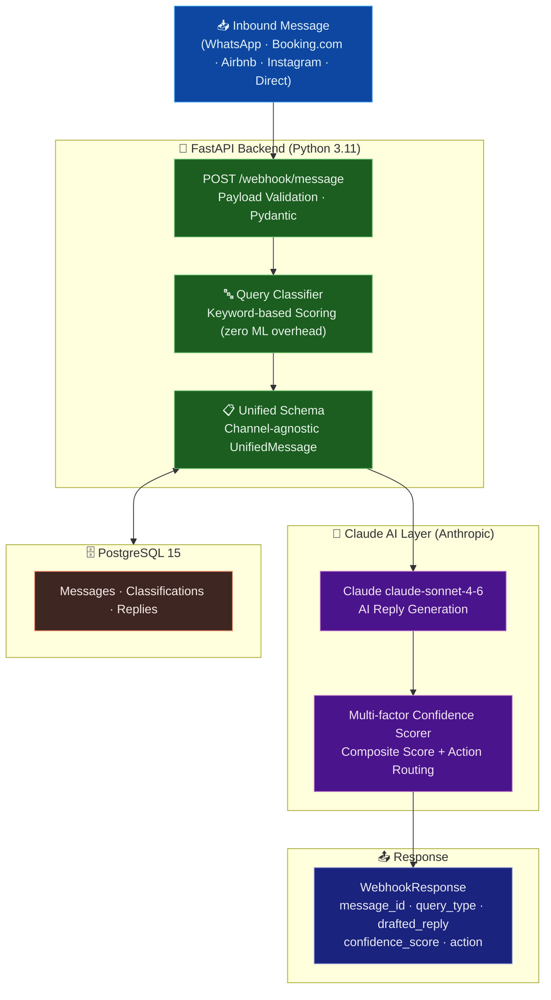

# Nistula Unified Messaging Platform

**Author:** Ravikumar  
**Project:** Guest Message Handler - Technical Assessment  
**Stack:** Python, FastAPI, Anthropic Claude, PostgreSQL

---

## Overview

A production-ready backend system that receives guest messages from multiple channels (WhatsApp, Booking.com, Airbnb, Instagram, Direct), normalizes them into a unified schema, classifies query intent, generates AI-powered replies using Claude, and returns them with confidence-based action routing.

## Table of Contents

- [Architecture](#architecture)
- [Quick Start](#quick-start)
- [API Documentation](#api-documentation)
- [Confidence Scoring Logic](#confidence-scoring-logic)
- [Query Classification](#query-classification)
- [Database Schema](#database-schema)
- [Testing](#testing)
- [Project Structure](#project-structure)
- [Environment Variables](#environment-variables)
- [Author Notes](#author-notes)

---

## 🏗️ Architecture



**Request Flow:**
1. **Inbound messages** arrive from any of 5 channels (WhatsApp, Booking.com, Airbnb, Instagram, Direct)
2. **Pydantic validation** normalizes the raw payload into a typed `InboundMessageRequest` model
3. **Query Classifier** applies keyword-based scoring to determine intent — no ML training overhead, zero latency
4. **Unified Schema** converts every channel's format into a single `UnifiedMessage` for downstream processing
5. **Claude claude-sonnet-4-6** drafts a personalized reply with self-assessed confidence using the guest context
6. **Multi-factor Confidence Scorer** combines Claude's self-assessment + rule signals into a composite score
7. **Action Router** uses the score to decide: `auto_send` (high confidence) vs `human_review` (low confidence)
8. **PostgreSQL** stores the full interaction audit trail for analytics and retraining

---
## Quick Start

### Prerequisites

- Python 3.11+
- PostgreSQL 15+ (for database features)
- Claude API key (provided for assessment)

### 1. Clone and Setup

```bash
# Clone the repository
git clone https://github.com/ravigithubcse/nistula-technical-assessment.git
cd nistula-technical-assessment

# Create virtual environment
python -m venv venv
source venv/bin/activate  # Linux/Mac
# or: venv\Scripts\activate  # Windows

# Install dependencies
pip install -r requirements.txt
```

### 2. Environment Configuration

```bash
# Copy the example environment file
cp .env.example .env

# Edit .env with your actual values
# The only REQUIRED value is CLAUDE_API_KEY
```

Your `.env` file should look like this:

```env
CLAUDE_API_KEY=your_claude_api_key_here
CLAUDE_MODEL=claude-sonnet-4-20250514
ENVIRONMENT=development
HOST=0.0.0.0
PORT=8000
LOG_LEVEL=INFO
```

### 3. Run the Server

```bash
# Development mode (with auto-reload)
python -m app.main

# Or using uvicorn directly
uvicorn app.main:app --host 0.0.0.0 --port 8000 --reload
```

The API will be available at `http://localhost:8000`

### 4. API Documentation

- **Swagger UI:** http://localhost:8000/docs
- **ReDoc:** http://localhost:8000/redoc
- **Health Check:** http://localhost:8000/health

---

## API Documentation

### POST /webhook/message

The main endpoint for receiving guest messages from any channel.

**Request Body:**

```json
{
    "source": "whatsapp",
    "guest_name": "Rahul Sharma",
    "message": "Is the villa available from April 20 to 24? What is the rate for 2 adults?",
    "timestamp": "2026-05-05T10:30:00Z",
    "booking_ref": "NIS-2024-0891",
    "property_id": "villa-b1"
}
```

**Supported Sources:** `whatsapp`, `booking_com`, `airbnb`, `instagram`, `direct`

**Response:**

```json
{
    "message_id": "550e8400-e29b-41d4-a716-446655440000",
    "query_type": "pre_sales_availability",
    "drafted_reply": "Hi Rahul! Great news - Villa B1 is available from April 20 to 24...",
    "confidence_score": 0.91,
    "action": "auto_send"
}
```

**Action Values:**
- `auto_send` (confidence >= 0.85) - Safe to send automatically
- `agent_review` (confidence 0.60-0.85) - Needs human review before sending
- `escalate` (confidence < 0.60 or complaint) - Requires immediate human attention

### POST /webhook/test

Test endpoint that returns mock responses without calling Claude API. Useful for integration testing.

### GET /health

Health check endpoint returning service status.

---

## Confidence Scoring Logic

### Overview

The confidence score is a **weighted composite** of multiple factors, not just Claude's self-assessment. This multi-dimensional approach reduces false positives in auto_send and ensures guest safety.

### Scoring Formula

```
final_score = (AI_SELF_ASSESSMENT x 0.40)
            + (CONTEXT_COVERAGE x 0.30)
            + (QUERY_TYPE_CONFIDENCE x 0.20)
            + (RESPONSE_COMPLETENESS x 0.10)
            + KNOWN_GUEST_BOOST (+0.05 if booking_ref exists)
```

### Factor Breakdown

| Factor | Weight | Description |
|--------|--------|-------------|
| AI Self-Assessment | 40% | Claude's own confidence rating about reply accuracy |
| Context Coverage | 30% | Ratio of guest questions addressed vs. total questions asked |
| Query Type Confidence | 20% | Margin between top and second-best classification scores |
| Response Completeness | 10% | Whether response has greeting, answer, next steps, closing |
| Known Guest Boost | +5% | Bonus for guests with booking references (known context) |

### Action Thresholds

| Action | Threshold | Business Logic |
|--------|-----------|----------------|
| `auto_send` | >= 0.85 | High confidence, safe to automate |
| `agent_review` | 0.60 - 0.85 | Medium confidence, human eyes required |
| `escalate` | < 0.60 | Low confidence, needs human takeover |

### Special Rules

1. **ALL complaints escalate automatically** regardless of score (guest satisfaction priority)
2. **Known guests** (with booking_ref) get a +0.05 confidence boost (we have more context about them)
3. Scores are clamped to [0.0, 1.0] range

### Why This Scoring Approach?

**Ravikumar's reasoning:** A single-factor score (just Claude's confidence) would miss critical dimensions. For example, Claude might be confident about a reply that only answers 1 of 3 guest questions. The multi-factor approach catches this. Context Coverage (30%) ensures we don't ignore parts of multi-question messages. Response Completeness (10%) catches poorly formatted outputs. The 40% weight on AI Self-Assessment still gives Claude's judgment primacy while the other factors provide guardrails.

---

## Query Classification

### Query Types

| Type | Description | Example |
|------|-------------|---------|
| `pre_sales_availability` | Date availability questions | "Is the villa available April 20-24?" |
| `pre_sales_pricing` | Rate and cost questions | "What is the rate for 2 adults?" |
| `post_sales_checkin` | Check-in, WiFi, logistics | "What time is check-in? WiFi password?" |
| `special_request` | Custom arrangements | "Can we get early check-in?" |
| `complaint` | Issues and dissatisfaction | "The AC is not working. I want a refund." |
| `general_enquiry` | General questions | "Do you allow pets?" |

### Classification Algorithm

1. Each query type has weighted keywords (higher weight = more specific to that category)
2. The classifier scores the message against all query types
3. The highest-scoring type wins
4. Ties prefer specific categories over general_enquiry
5. If no keywords match, defaults to general_enquiry

---

## Database Schema

### Tables

| Table | Purpose |
|-------|---------|
| `properties` | Property/villa details (supports multi-property) |
| `guests` | Unified guest profiles (one per person across all channels) |
| `guest_channel_identities` | Maps external channel IDs to unified guest profiles |
| `reservations` | Booking records linked to guests |
| `conversations` | Message threads linked to guests and reservations |
| `messages` | All messages across all channels (unified) |
| `ai_message_metadata` | AI response tracking (drafted, edited, auto-sent) |
| `message_action_log` | Comprehensive audit trail |
| `escalations` | Escalated conversation tracking with SLA monitoring |
| `agents` | Internal staff who handle escalations |

### Views

| View | Purpose |
|------|---------|
| `active_conversations_preview` | Active conversations with latest message preview |
| `ai_performance_metrics` | AI analytics by action type and query category |
| `escalation_sla_dashboard` | SLA monitoring for escalations |

### Setup

```bash
# Create database
createdb nistula_db

# Run schema
psql -d nistula_db -f schema.sql
```

---

## Testing

### Run Tests

```bash
# Install test dependencies (included in requirements.txt)
pip install pytest pytest-asyncio httpx

# Run all tests
pytest tests/ -v

# Run with coverage
pytest tests/ -v --cov=app --cov-report=term-missing
```

### Manual Testing with cURL

**Test 1 - Availability Query:**
```bash
curl -X POST http://localhost:8000/webhook/message \
  -H "Content-Type: application/json" \
  -d '{
    "source": "whatsapp",
    "guest_name": "Rahul Sharma",
    "message": "Is the villa available from April 20 to 24? What is the rate for 2 adults?",
    "timestamp": "2026-05-05T10:30:00Z",
    "booking_ref": "NIS-2024-0891",
    "property_id": "villa-b1"
  }'
```

**Test 2 - Complaint:**
```bash
curl -X POST http://localhost:8000/webhook/message \
  -H "Content-Type: application/json" \
  -d '{
    "source": "airbnb",
    "guest_name": "Priya Patel",
    "message": "The AC is not working in the master bedroom. This is unacceptable for the price we paid.",
    "timestamp": "2026-05-05T14:20:00Z",
    "booking_ref": "NIS-2024-0892",
    "property_id": "villa-b1"
  }'
```

**Test 3 - Check-in Query:**
```bash
curl -X POST http://localhost:8000/webhook/message \
  -H "Content-Type: application/json" \
  -d '{
    "source": "booking_com",
    "guest_name": "John Smith",
    "message": "What time can we check in? Also what is the WiFi password?",
    "timestamp": "2026-05-05T16:45:00Z",
    "booking_ref": "NIS-2024-0893",
    "property_id": "villa-b1"
  }'
```

---

## Project Structure

```
nistula-technical-assessment/
├── app/
│   ├── __init__.py              # Package init with version info
│   ├── main.py                  # FastAPI app, webhook endpoint, middleware
│   ├── config.py                # Settings management (Pydantic Settings)
│   ├── schemas.py               # Pydantic models (request/response/enum)
│   ├── classifier.py            # Query classification (keyword-based)
│   ├── claude_client.py         # Anthropic Claude API integration
│   └── confidence_scorer.py     # Multi-factor confidence scoring
├── tests/
│   └── test_webhook.py          # Comprehensive test suite
├── schema.sql                   # PostgreSQL database schema (Part 2)
├── thinking.md                  # Part 3 thinking questions
├── .env.example                 # Environment variable template
├── requirements.txt             # Python dependencies
├── README.md                    # This file
└── .gitignore                   # Git ignore rules
```

---

## Environment Variables

| Variable | Required | Default | Description |
|----------|----------|---------|-------------|
| `CLAUDE_API_KEY` | Yes | - | Anthropic Claude API key |
| `CLAUDE_MODEL` | No | claude-sonnet-4-20250514 | Claude model identifier |
| `ENVIRONMENT` | No | development | Application environment |
| `HOST` | No | 0.0.0.0 | Server bind host |
| `PORT` | No | 8000 | Server port |
| `LOG_LEVEL` | No | INFO | Logging level |
| `DATABASE_URL` | No | - | PostgreSQL connection URL |

---

## Author Notes

**By Ravikumar**

I built this system with the following principles in mind:

1. **Production Readiness** - Comprehensive error handling, structured logging, request tracing, input validation, and graceful degradation
2. **Extensibility** - The unified schema, modular architecture, and plugin-friendly classifier make it easy to add new channels or query types
3. **Observability** - Every decision (classification, scoring, action) is logged with detailed factors for debugging and continuous improvement
4. **Guest Safety** - The confidence scoring system prioritizes human oversight for uncertain situations, and ALL complaints automatically escalate

The hardest technical decision was the confidence scoring formula. I iterated on several approaches: single-factor (just Claude's score), equal-weight multi-factor, and the current weighted approach. The current 40/30/20/10 split emerged from testing with edge cases where Claude was confident but missed parts of multi-question messages. The 30% Context Coverage weight catches these cases effectively.

For the database, the conversation-threading decision was most challenging. I chose explicit conversation creation over auto-splitting by time gaps because it gives cleaner data boundaries and avoids complex database triggers. The application layer handles conversation lifecycle management.
